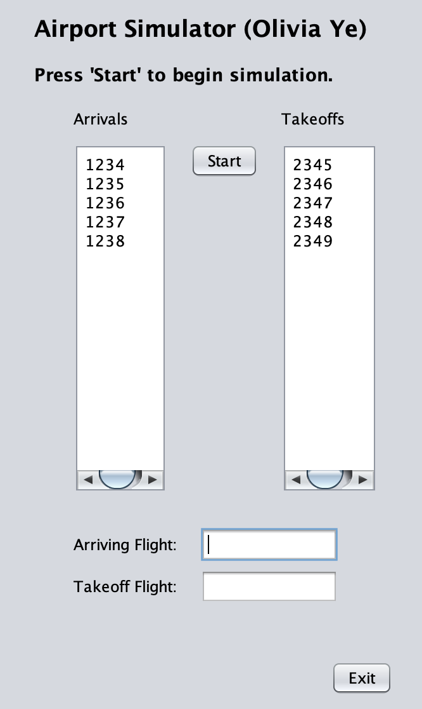
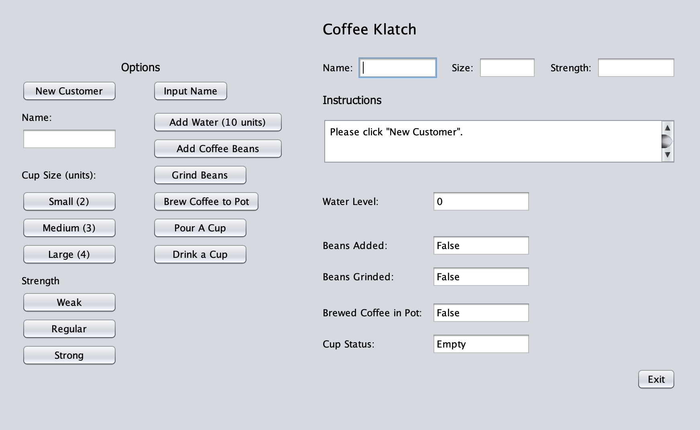
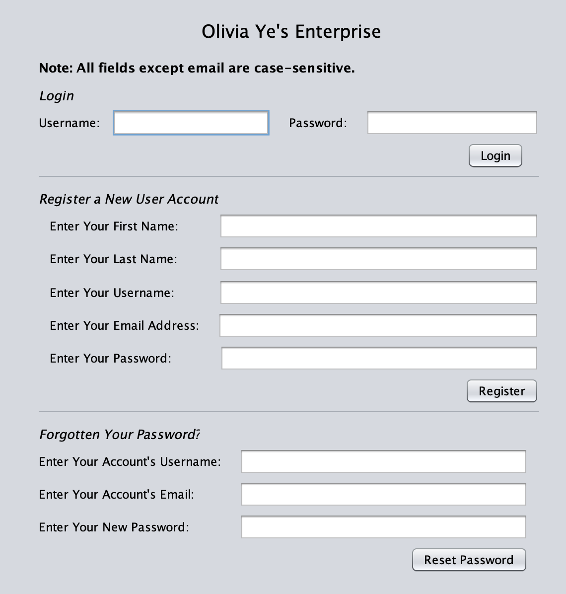

# AP Computer Science, Grade 12

## Airport Flight Control Simulator

For the final course project, I was tasked with building a game program that simulates planes landing and taking off.   
Developed January 2021.

### Technical Details

* Used the Netbeans GUI builder to create a user interface 
* Implements timers to time takeoff and landing (4 seconds to take off, 2 seconds to land)
* Uses queues to manipulate plantes in both queues
* Implements loops and conditions, uses try-catch structures for error checking
 

## Caesar Cipher
Created a basic encoder and decoder caesar cipher with a console interface.  
Date developed: November 2020

### Technical Details

* Implements loops and conditions.
 

## Coffee Klatsch Simulator

Developed a coffee-making simulation.    
Date developed: December 2020

### Technical Details

* Used the Netbeans GUI builder to create a user interface
* Implements object oriented programming for each cup of coffee and each coffee machine
* Implements loops and conditions, uses try-catch structures for error checking
 

## Login Interface

Created a login portal simulation.  
Date developed: November 2020

### Technical Details

* Used the Netbeans GUI builder to create a user interface
* Implements hashing with MD5
* Implements loops and conditions, uses try-catch structures for error checking
 

## Sorting and Searching Practice
Created a login portal simulation.  
Date developed: December 2020

### Technical Details

* Wrote ascending/descending selection, insertion, and bubble sort algorithms
* Practice with binary search

